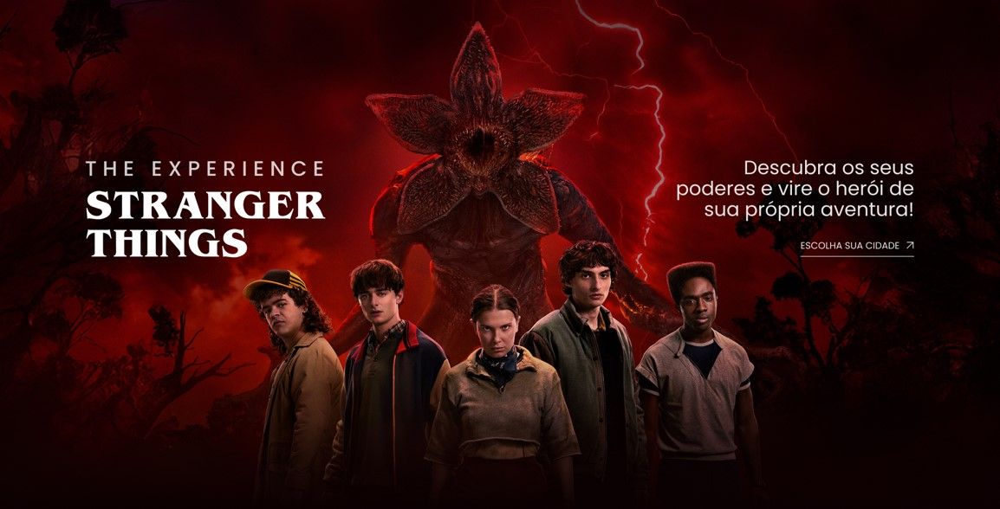

# DevArt - Stranger Things Landing Page 👾

Este projeto foi desenvolvido durante o evento online **DevArt – Edit Stranger Things**, promovido por [Gustavo Campelo](https://gustavocampelo.com.br/devart-strangerthings/?utm_source=www.google.com&sck=1771620250976_17716200758936).

O foco foi construir uma **landing page temática, moderna e responsiva**, aplicando conceitos de layout, organização de CSS e animações para criar uma experiência visual imersiva inspirada no universo de *Stranger Things*.

---

## 📸 Preview

---

## 🎯 Objetivo do Projeto

Reproduzir o layout apresentado no evento e desenvolver uma landing page completa, incluindo:

- Estrutura HTML organizada e semântica
- Layout responsivo (Desktop, Tablet e Mobile)
- Seções com cards organizadas com Flexbox
- Animações e microinterações em CSS
- Texto animado contínuo no footer
- Botão com underline animado usando pseudo-elemento

---

## 🛠️ Tecnologias Utilizadas

- **HTML5**
- **CSS3**
  - Flexbox
  - Media Queries
  - Animações com `@keyframes`
  - Pseudo-elementos (`::after`)
- **Metodologia BEM**
- Organização modular de CSS por blocos

---

## 🧠 O que eu aprendi

### ✔️ Estruturação e Organização de Layout
- Construção de seções utilizando Flexbox.
- Controle de largura com `max-width` e `margin: 0 auto`.
- Correção de overflow horizontal causado por `min-width` em elementos flex.
- Uso estratégico de `flex-wrap` para evitar scroll lateral.

---

### ✔️ Responsividade
- Implementação de breakpoints para:
  - Mobile (até 768px)
  - Tablet (até 1024px)
- Conversão de layouts em linha para coluna.
- Ajustes de padding lateral para evitar compressão.
- Centralização de conteúdo em telas menores.

---

### ✔️ Animações e Microinterações
- Underline animado utilizando `::after`.
- Uso de `transition` para suavizar interações.
- Animação de texto contínuo no footer com `@keyframes`.
- Manipulação de `transform` (`translate`, `scaleX`) para animações mais performáticas.
- Uso de `overflow: hidden` para criar efeito de máscara no texto animado.

---

### ✔️ Organização CSS
- Separação de estilos em:
  - `header.css`
  - `main.css`
  - `footer.css`
- Media queries centralizadas no `index.css`.
- Estrutura escalável e de fácil manutenção.

---

## 📚 Possíveis Melhorias Futuras

- Implementar animações baseadas em scroll (Intersection Observer).
- Adicionar efeito parallax no background.
- Criar versão com JavaScript para interações mais dinâmicas.
- Melhorar acessibilidade (aria-labels e contraste).
- Refatorar para versão em **React**, com componentização.
- Adicionar alternância de tema (Dark/Light Mode).

---

## 🔗 Links

- 🎓 **Evento DevArt – Stranger Things**  
  https://gustavocampelo.com.br/devart-strangerthings/?utm_source=www.google.com&sck=1771620250976_17716200758936

- 💻 **Projeto Online**  
  https://estefpimenta.github.io/stranger-things-experience-DevArt/